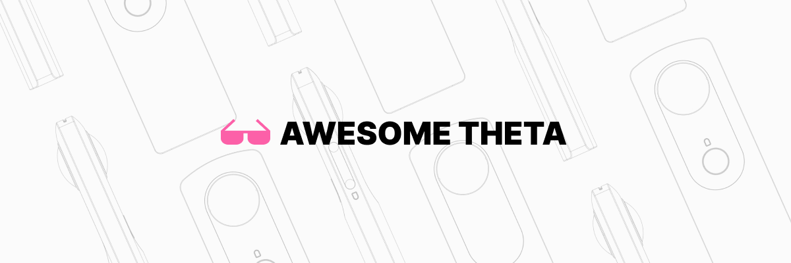

  

# Awesome THETA 

A curated list of awesome things related to [RICOH THETA](https://theta360.com)

## Contents

- [Documentation](#documentation)
- [SDK and Libraries](#sdk-and-libraries)
- [Communities](#communities)
- [Contributions](#contributions)

## Documentation

- [theta-api-specs](https://github.com/ricohapi/theta-api-specs) - RICOH THETA API specifications

## SDK and Libraries

### Plugin

- [theta-plugin-sdk](https://github.com/ricohapi/theta-plugin-sdk) - A plugin sample project of Android Studio
- [theta-plugin-camera-api-sample](https://github.com/ricohapi/theta-plugin-camera-api-sample) - Camera API capture plugin sample
- [theta-plugin-camera-api-sample-x](https://github.com/ricohapi/theta-plugin-camera-api-sample-x) - Camera API capture plugin sample for RICOH THETA X
- [theta-automatic-face-blur-plugin](https://github.com/ricohapi/theta-automatic-face-blur-plugin) - Automatic face blur plugin
- [theta-wireless-live-streaming-plugin](https://github.com/ricohapi/theta-wireless-live-streaming-plugin) - Wireless live streaming plugin
- [theta-cloud-upload-v2-plugin](https://github.com/ricohapi/theta-cloud-upload-v2-plugin) - File cloud upload V2 plugin
- [theta-vr-media-connection-plugin](https://github.com/ricohapi/theta-vr-media-connection-plugin) - VR media connection plugin

### Mobile

- [theta-client](https://github.com/ricohapi/theta-client) - Client library wrapped Web API v2.1 to control THETA
- [theta-api2.1-ios-sdk](https://github.com/ricohapi/theta-api2.1-ios-sdk) - A sample application project using Web API v2.1 for iOS
- [theta-api2.1-android-sdk](https://github.com/ricohapi/theta-api2.1-android-sdk) - A sample application project using Web API v2.1 for Android

### USB

- [libuvc-theta](https://github.com/ricohapi/libuvc-theta) - [libuvc](https://github.com/libuvc/libuvc) adding support for UVC1.5/H.264
- [libuvc-theta-sample](https://github.com/ricohapi/libuvc-theta-sample) - Samples for [libuvc-theta](https://github.com/ricohapi/libuvc-theta)
- [gstthetauvc](https://github.com/nickel110/gstthetauvc) - GStreamer THETA UVC plugin
- [libptp2](https://github.com/nickel110/libptp2) - [libptp](https://libptp.sourceforge.net) modified for the THETA USB API

## Communities

- [THETA Developer Community](https://thetadeveloper.slack.com/join/shared_invite/enQtNzcxODI2MTk2ODg0LWY5YmU2ZTIxNGYwNzlmNWZjMWMyMWFlMzY3ZmQ3NGU3ZjZiZjI0Njk4MGIxMDU5NDJiMzQ4Y2FkNDEzYmFlNGU#/shared-invite/email) - Official developer community on Slack (Japanese)
- [theta360.guide](https://theta360.guide) - The RICOH THETA developer and power user community
- [RICOH THETAプラグイン開発者コミュニティ - Qiita](https://qiita.com/organizations/theta-plugin) - The plugin developer community (Japanese)
- [theta-skunkworks](https://github.com/theta-skunkworks) - The THETA SKUNKWORKS TEAM based on the RICOH developer community

## Contributions

Contributions are always welcome! Please read the [contribution guidelines](contributing.md) first.
