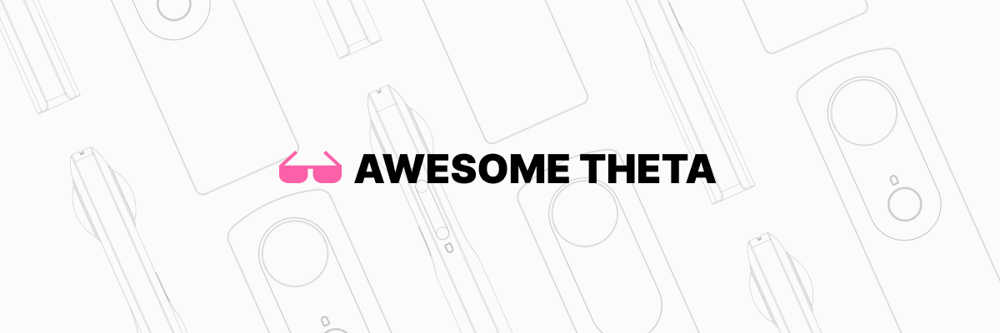

  

# Awesome THETA 

A curated list of awesome things related to [RICOH THETA](https://www.ricoh360.com/theta/)

> [!NOTE]  
> If you have any questions or suggestions, please visit [Discussions](https://github.com/ricohapi/awesome-theta/discussions?discussions_q=) and create a new discussion thread.

## :camera: THETA Hardware

- [RICOH THETA](https://www.ricoh360.com/theta/)
- Download Exterior 3D data of RICOH THETA [[English](https://pages.ricoh360.com/theta-3d-data) / [Japanese](https://pages.ricoh360.com/ja/theta-3d-data)]

## :link: THETA API

- [RICOH360 Docs for Developers](https://docs.ricoh360.com/)
- [theta-api-specs](https://github.com/ricohapi/theta-api-specs) - RICOH THETA API specifications

## :iphone: THETA Mobile SDK and Library

- [theta-client](https://github.com/ricohapi/theta-client) - Client library using Web API v2.1 to control THETA
- [theta-ble-client](https://github.com/ricohapi/theta-ble-client) - Client library using Bluetooth API to control THETA
- [fake-theta](https://github.com/ricohapi/fake-theta) - THETA Web API response simulator
- [theta-api2.1-ios-sdk](https://github.com/ricohapi/theta-api2.1-ios-sdk) - [archived] A sample application project using Web API v2.1 for iOS
- [theta-api2.1-android-sdk](https://github.com/ricohapi/theta-api2.1-android-sdk) - [archived] A sample application project using Web API v2.1 for Android

## :electric_plug: THETA Plugin

- [theta-plugin-library](https://github.com/ricohapi/theta-plugin-library) - Library including THETA specified methods and APIs
- [theta-plugin-sdk](https://github.com/ricohapi/theta-plugin-sdk) - Sample project
- [theta-plugin-camera-api-sample](https://github.com/ricohapi/theta-plugin-camera-api-sample) - Sample project of Camera API usage
- [theta-plugin-camera-api-sample-x](https://github.com/ricohapi/theta-plugin-camera-api-sample-x) - Sample project of Camera API usage for RICOH THETA X
- [theta-automatic-face-blur-plugin](https://github.com/ricohapi/theta-automatic-face-blur-plugin) - Automatic face blur plugin
- [theta-wireless-live-streaming-plugin](https://github.com/ricohapi/theta-wireless-live-streaming-plugin) - Wireless live streaming plugin
- [theta-cloud-upload-v2-plugin](https://github.com/ricohapi/theta-cloud-upload-v2-plugin) - File cloud upload V2 plugin
- [theta-vr-media-connection-plugin](https://github.com/ricohapi/theta-vr-media-connection-plugin) - VR media connection plugin

## USB

- [libuvc-theta](https://github.com/ricohapi/libuvc-theta) - [libuvc](https://github.com/libuvc/libuvc) adding support for UVC1.5/H.264
- [libuvc-theta-sample](https://github.com/ricohapi/libuvc-theta-sample) - Samples for [libuvc-theta](https://github.com/ricohapi/libuvc-theta)

## Communities

- [theta360.guide](https://community.theta360.guide/) - RICOH THETA developer and power user community
- [Ricoh THETA 360° Camera User Group](https://www.facebook.com/groups/ricohtheta360community) - Facebook user community
- [RICOH THETAプラグイン開発者コミュニティ - Qiita](https://qiita.com/organizations/theta-plugin) - Plugin developer community (Japanese)
- [theta-skunkworks](https://github.com/theta-skunkworks) - The THETA SKUNKWORKS TEAM based on the RICOH developer community

## Contributions

Contributions are always welcome! Please read the [contribution guidelines](contributing.md) first.
